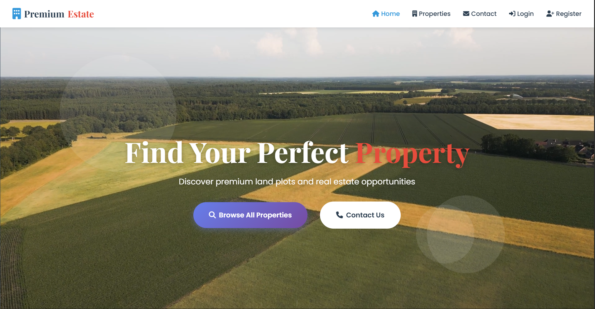
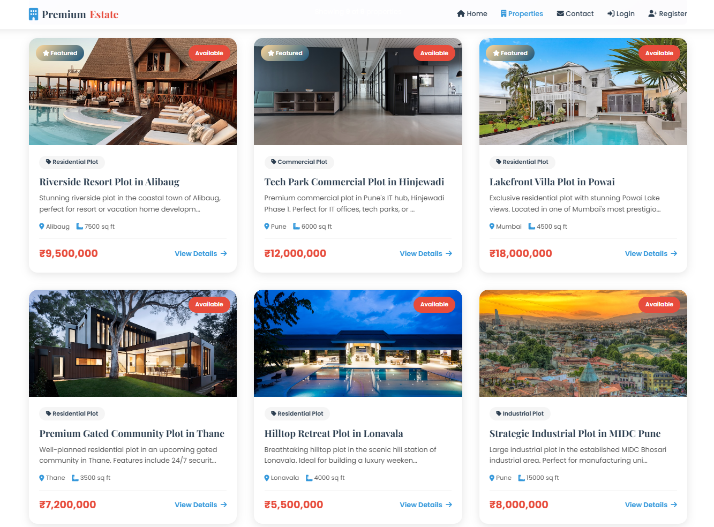
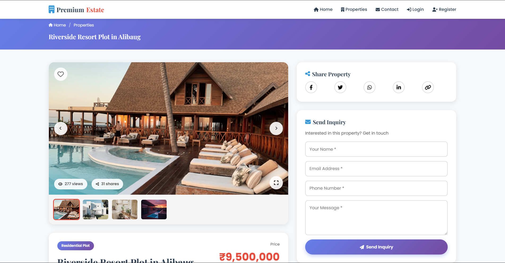
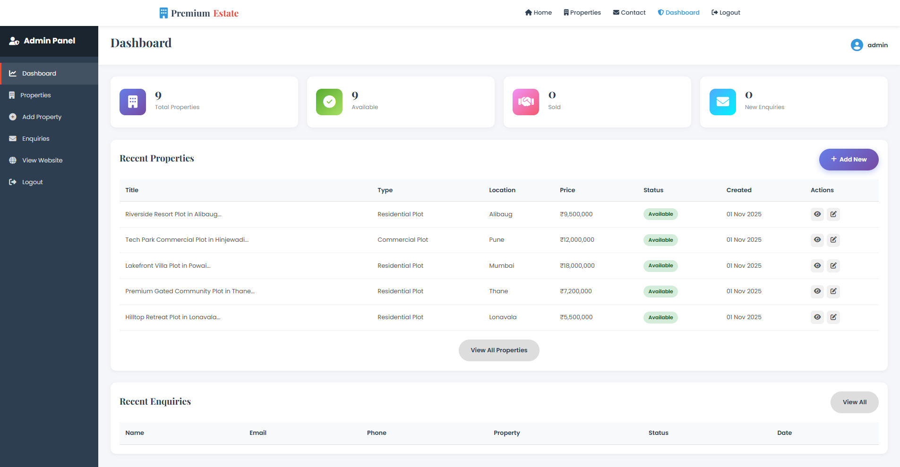
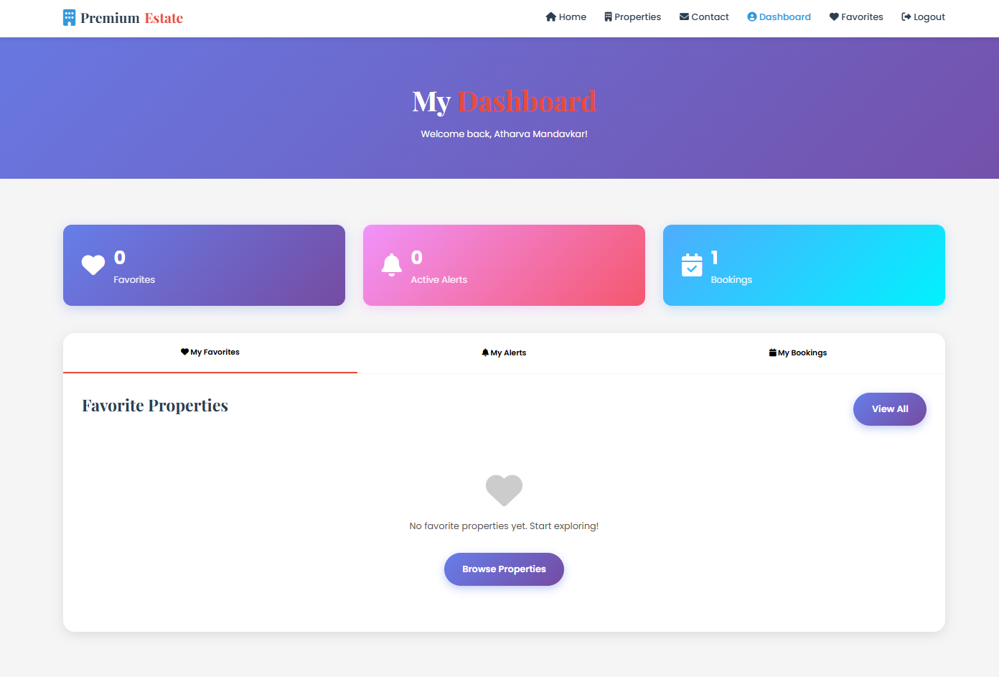
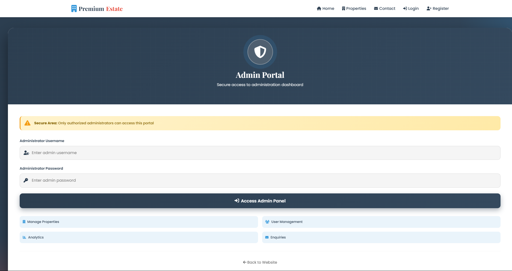

# 🏡 Real Estate Website - Complete Property Management Platform



<div align="center">

[](https://www.python.org/)
[](https://flask.palletsprojects.com/)
[](https://www.sqlalchemy.org/)
[](LICENSE)

A full-featured real estate property management platform built with Flask, featuring property listings, user authentication, booking system, and comprehensive admin dashboard.

[Features](#-features) • [Installation](#-installation) • [Usage](#-usage) • [Screenshots](#-screenshots) • [API](#-api-routes) • [Contributing](#-contributing)

</div>

---

## 📋 Table of Contents

- [Overview](#-overview)
- [Features](#-features)
- [Technology Stack](#-technology-stack)
- [Project Structure](#-project-structure)
- [Installation](#-installation)
- [Configuration](#-configuration)
- [Usage](#-usage)
- [Screenshots](#-screenshots)
- [Database Models](#-database-models)
- [API Routes](#-api-routes)
- [Admin Panel](#-admin-panel)
- [User Features](#-user-features)
- [Contributing](#-contributing)
- [License](#-license)

---

## 🌟 Overview

This **Real Estate Website** is a comprehensive property management platform designed for real estate agencies, property dealers, and individual sellers. The platform enables property listing, browsing, user management, booking system, and advanced analytics through an intuitive admin dashboard.

### 🎯 Key Highlights

- **Dual Interface**: Separate portals for administrators and end-users
- **Property Management**: Complete CRUD operations for properties with images, videos, and documents
- **User Authentication**: Secure registration and login system with password hashing
- **Booking System**: Schedule property site visits with time slot management
- **Favorites & Alerts**: Users can save favorite properties and set up property alerts
- **Advanced Search**: Filter properties by type, price, location, and area
- **Analytics Dashboard**: Real-time statistics and insights for administrators
- **Responsive Design**: Mobile-first design that works on all devices
- **File Upload**: Support for images, videos, and documents (PDFs, DOCs)

---

## ✨ Features

### 🏠 Property Features
- ✅ Create, Read, Update, Delete (CRUD) operations for properties
- ✅ Multiple property types: Residential, Commercial, Agricultural, Industrial
- ✅ Multiple image uploads with primary image selection
- ✅ YouTube/Vimeo video integration
- ✅ Document attachments (PDFs, DOCs)
- ✅ Property status tracking (Available, Reserved, Sold)
- ✅ Featured property highlighting
- ✅ View and share counters
- ✅ Location with GPS coordinates (Latitude/Longitude)
- ✅ Advanced filtering and sorting

### 👥 User Features
- ✅ User registration and authentication
- ✅ Personal dashboard
- ✅ Favorite properties management
- ✅ Property alerts with custom criteria
- ✅ Site visit booking system
- ✅ Enquiry submission
- ✅ Activity history

### 🔐 Admin Features
- ✅ Secure admin login
- ✅ Comprehensive dashboard with statistics
- ✅ Property management interface
- ✅ User management
- ✅ Enquiry management
- ✅ Booking management
- ✅ Analytics and reports
- ✅ Activity logs

### 📊 Analytics & Reporting
- ✅ Total properties, users, bookings, enquiries
- ✅ Property type distribution
- ✅ Monthly property additions
- ✅ Most viewed properties
- ✅ User activity tracking

---

## 🛠 Technology Stack

### Backend
- **Flask 2.3.3** - Python web framework
- **SQLAlchemy 3.0.5** - SQL toolkit and ORM
- **Flask-WTF 1.1.1** - Form handling and validation
- **Werkzeug 2.3.7** - WSGI utility library
- **Python-dotenv 1.0.0** - Environment variable management

### Frontend
- **HTML5** - Structure and content (56.3%)
- **CSS3** - Styling and animations (20.1%)
- **JavaScript** - Interactive features (6.5%)
- **Bootstrap 5** - Responsive framework
- **Font Awesome** - Icons

### Database
- **SQLite** - Development database (easily upgradable to PostgreSQL/MySQL)

### Security
- **Werkzeug Security** - Password hashing
- **Flask Sessions** - Secure session management
- **CSRF Protection** - Form security

---

## 📁 Project Structure

```
Real-Estate-Website/
│
├── app.py                      # Main application file with all routes
├── config.py                   # Configuration settings
├── models.py                   # Database models
├── forms.py                    # WTForms definitions
├── seed_data.py               # Database seeding script
├── requirements.txt           # Python dependencies
├── .env                       # Environment variables
├── .gitignore                # Git ignore rules
│
├── static/                    # Static files
│   ├── css/                  # Stylesheets
│   ├── js/                   # JavaScript files
│   ├── images/               # Static images
│   ├── favicon.ico          # Site icon
│   └── uploads/             # User uploaded files
│       ├── images/          # Property images
│       ├── videos/          # Property videos
│       └── documents/       # Property documents
│
├── templates/                 # HTML templates
│   ├── base.html             # Base template
│   ├── index.html            # Homepage
│   ├── properties.html       # Property listings
│   ├── property_detail.html  # Property details
│   ├── contact.html          # Contact page
│   ├── 404.html              # Error page
│   │
│   ├── admin/                # Admin templates
│   │   ├── login.html
│   │   ├── dashboard.html
│   │   ├── properties.html
│   │   ├── add_property.html
│   │   ├── edit_property.html
│   │   ├── enquiries.html
│   │   ├── bookings.html
│   │   ├── users.html
│   │   └── analytics.html
│   │
│   └── user/                 # User templates
│       ├── register.html
│       ├── login.html
│       ├── dashboard.html
│       ├── favorites.html
│       └── create_alert.html
│
└── instance/                  # Instance-specific files
    └── realestate.db         # SQLite database (auto-generated)
```

---

## 🚀 Installation

### Prerequisites

Before you begin, ensure you have the following installed:
- **Python 3.8+** - [Download Python](https://www.python.org/downloads/)
- **pip** - Python package installer (comes with Python)
- **Git** - [Download Git](https://git-scm.com/downloads/)

### Step 1: Clone the Repository

```bash
# Clone the repository
git clone https://github.com/Atharva0177/Real-Estate-Website.git

# Navigate to project directory
cd Real-Estate-Website
```


### Step 2: Create Virtual Environment

```bash
# Create virtual environment
python -m venv venv

# Activate virtual environment

# On Windows:
venv\Scripts\activate

# On macOS/Linux:
source venv/bin/activate
```

### Step 3: Install Dependencies

```bash
# Install required packages
pip install -r requirements.txt
```

**Requirements include:**
```
Flask==2.3.3
Flask-SQLAlchemy==3.0.5
Flask-WTF==1.1.1
WTForms==3.0.1
Flask-Login==0.6.2
email-validator==2.0.0
Pillow==10.0.0
python-dotenv==1.0.0
Werkzeug==2.3.7
```

### Step 4: Configure Environment Variables

The `.env` file is already configured with default values:

```env
SECRET_KEY=qwertyuiop
ADMIN_USERNAME=admin
ADMIN_PASSWORD=admin123
DATABASE_URL=sqlite:///realestate.db
```

**⚠️ Important:** Change these values in production!

### Step 5: Initialize Database

```bash
# Run the seed data script to create database and sample data
python seed_data.py
```

This will:
- Create all database tables
- Add 9 sample properties with images
- Create 2 demo user accounts
- Display login credentials


### Step 6: Run the Application

```bash
# Start the Flask development server
python app.py
```

The application will be available at: **http://localhost:8000**

```
 * Running on http://0.0.0.0:8000
 * Debug mode: on
```

---

## ⚙️ Configuration

### config.py Settings

```python
class Config:
    # Security
    SECRET_KEY = 'your-secret-key-change-in-production'
    
    # Database
    SQLALCHEMY_DATABASE_URI = 'sqlite:///realestate.db'
    SQLALCHEMY_TRACK_MODIFICATIONS = False
    
    # File Uploads
    UPLOAD_FOLDER = os.path.join('static', 'uploads')
    MAX_CONTENT_LENGTH = 50 * 1024 * 1024  # 50MB
    ALLOWED_EXTENSIONS = {'png', 'jpg', 'jpeg', 'gif', 'mp4', 'webm', 'ogg', 'pdf', 'doc', 'docx'}
    
    # Session
    PERMANENT_SESSION_LIFETIME = timedelta(hours=24)
    
    # Pagination
    PROPERTIES_PER_PAGE = 9
    
    # Admin Credentials
    ADMIN_USERNAME = 'admin'
    ADMIN_PASSWORD = 'admin123'  # ⚠️ Change in production!
```

### Production Deployment Checklist

- [ ] Change `SECRET_KEY` to a random secure value
- [ ] Update `ADMIN_USERNAME` and `ADMIN_PASSWORD`
- [ ] Switch to PostgreSQL or MySQL database
- [ ] Set `DEBUG = False`
- [ ] Configure proper email settings for notifications
- [ ] Set up HTTPS/SSL
- [ ] Configure file storage (AWS S3, etc.)
- [ ] Set up backup system

---

## 📖 Usage

### Default Login Credentials

#### 🔐 Admin Access
```
URL: http://localhost:8000/admin/login
Username: admin
Password: admin123
```

#### 👤 Demo User Account
```
Email: demo@example.com
Password: demo123
```

#### 👤 Atharva User Account
```
Email: atharva@example.com
Password: atharva123
```

---

## 📸 Screenshots

### Homepage

*Modern and clean homepage with featured properties*

### Property Listings

*Advanced search and filter options with property cards*

### Property Details

*Detailed property view with image gallery, videos, and booking form*

### Admin Dashboard

*Comprehensive analytics and statistics*

### User Dashboard

*Personal dashboard with favorites and bookings*

---

## 🗄️ Database Models

### Property Model
```python
class Property(db.Model):
    - id (Primary Key)
    - title
    - description
    - property_type (Residential/Commercial/Agricultural/Industrial)
    - price
    - area
    - location
    - address
    - latitude, longitude
    - status (Available/Reserved/Sold)
    - featured (Boolean)
    - views, shares (Integer)
    - created_at, updated_at (DateTime)
    
    Relationships:
    - images (One-to-Many)
    - videos (One-to-Many)
    - documents (One-to-Many)
    - favorites (One-to-Many)
    - bookings (One-to-Many)
```

### User Model
```python
class User(db.Model):
    - id (Primary Key)
    - name
    - email (Unique)
    - phone
    - password_hash
    - created_at (DateTime)
    
    Relationships:
    - favorites (One-to-Many)
    - alerts (One-to-Many)
    - bookings (One-to-Many)
```

### Booking Model
```python
class Booking(db.Model):
    - id (Primary Key)
    - user_id (Foreign Key)
    - property_id (Foreign Key)
    - booking_date
    - booking_time
    - visitor_name
    - visitor_email
    - visitor_phone
    - number_of_visitors
    - message
    - status (Pending/Confirmed/Cancelled/Completed)
    - created_at (DateTime)
```

### Other Models
- **PropertyImage** - Property images with primary flag
- **PropertyVideo** - YouTube/Vimeo video URLs
- **PropertyDocument** - Property-related documents
- **Enquiry** - Contact enquiries
- **Favorite** - User saved properties
- **PropertyAlert** - User property alerts
- **ActivityLog** - System activity tracking

---

## 🔗 API Routes

### Public Routes

| Method | Endpoint | Description |
|--------|----------|-------------|
| GET | `/` | Homepage with featured properties |
| GET | `/properties` | Property listings with filters |
| GET | `/property/<id>` | Property details |
| POST | `/enquiry` | Submit enquiry |
| GET | `/contact` | Contact page |

### User Authentication Routes

| Method | Endpoint | Description |
|--------|----------|-------------|
| GET/POST | `/user/register` | User registration |
| GET/POST | `/user/login` | User login |
| GET | `/user/logout` | User logout |
| GET | `/user/dashboard` | User dashboard |

### User Feature Routes

| Method | Endpoint | Description |
|--------|----------|-------------|
| POST | `/favorite/toggle/<id>` | Toggle favorite property |
| GET | `/user/favorites` | View favorites |
| GET/POST | `/alert/create` | Create property alert |
| POST | `/alert/delete/<id>` | Delete alert |
| POST | `/booking/create/<id>` | Book site visit |
| POST | `/booking/cancel/<id>` | Cancel booking |

### Admin Routes

| Method | Endpoint | Description |
|--------|----------|-------------|
| GET/POST | `/admin/login` | Admin login |
| GET | `/admin/logout` | Admin logout |
| GET | `/admin/dashboard` | Admin dashboard |
| GET | `/admin/properties` | Manage properties |
| GET/POST | `/admin/property/add` | Add new property |
| GET/POST | `/admin/property/edit/<id>` | Edit property |
| POST | `/admin/property/delete/<id>` | Delete property |
| GET | `/admin/enquiries` | Manage enquiries |
| GET | `/admin/bookings` | Manage bookings |
| GET | `/admin/users` | Manage users |
| GET | `/admin/analytics` | View analytics |

---

## 🔐 Admin Panel

### Access Admin Panel

Navigate to: `http://localhost:8000/admin/login`



### Admin Features

#### 📊 Dashboard
- Real-time statistics
- Total properties, users, bookings, enquiries
- Total views and shares
- Recent activities log

#### 🏠 Property Management
- Add new properties with images, videos, documents
- Edit existing properties
- Delete properties
- Mark as featured
- Change status (Available/Reserved/Sold)

#### 📝 Enquiry Management
- View all enquiries
- Filter by status (New/Contacted/Closed)
- Update enquiry status
- View property details

#### 📅 Booking Management
- View all site visit bookings
- Filter by status (Pending/Confirmed/Cancelled/Completed)
- Update booking status
- View booking details

#### 👥 User Management
- View all registered users
- User details and activity
- User statistics

#### 📈 Analytics
- Property type distribution
- Monthly property additions
- Most viewed properties
- User engagement metrics

---

## 👤 User Features

### User Dashboard

Access at: `http://localhost:8000/user/dashboard`


#### ❤️ Favorites
- Save favorite properties
- Quick access to saved properties
- One-click toggle

#### 🔔 Property Alerts
- Set custom search criteria
- Get notified of matching properties
- Manage multiple alerts

#### 📅 My Bookings
- View scheduled site visits
- Check booking status
- Cancel bookings

#### 📊 Activity History
- View browsing history
- Track enquiries
- Download documents

---

## 🎨 Customization

### Changing Colors and Branding

Edit the CSS files in `static/css/` directory:

```css
/* Primary brand color */
:root {
    --primary-color: #3498db;
    --secondary-color: #2ecc71;
    --danger-color: #e74c3c;
}
```

### Adding New Property Types

Edit `forms.py`:

```python
property_type = SelectField('Property Type', 
    choices=[
        ('Residential Plot', 'Residential Plot'),
        ('Commercial Plot', 'Commercial Plot'),
        ('Agricultural Land', 'Agricultural Land'),
        ('Industrial Plot', 'Industrial Plot'),
        ('Your New Type', 'Your New Type'),  # Add here
    ],
    validators=[DataRequired()]
)
```

---

## 🧪 Testing

### Run Tests

```bash
# Install testing dependencies
pip install pytest pytest-flask

# Run tests
pytest tests/
```

### Manual Testing Checklist

- [x] User registration and login
- [x] Admin login
- [x] Property creation with images
- [x] Property search and filters
- [x] Favorite property functionality
- [x] Booking system
- [x] Enquiry submission
- [x] File uploads
- [x] Responsive design on mobile

---


## 📝 License

This project is licensed under the MIT License - see the [LICENSE](LICENSE) file for details.

```
MIT License

Copyright (c) 2025 Atharva

Permission is hereby granted, free of charge, to any person obtaining a copy
of this software and associated documentation files (the "Software"), to deal
in the Software without restriction, including without limitation the rights
to use, copy, modify, merge, publish, distribute, sublicense, and/or sell
copies of the Software...
```

---


## 🙏 Acknowledgments

- **Flask** - Excellent Python web framework
- **Bootstrap** - Responsive CSS framework
- **Font Awesome** - Beautiful icons
- **Unsplash** - Free high-quality images
- **SQLAlchemy** - Powerful ORM

---


## 🎯 Future Enhancements

- [ ] Email notifications
- [ ] SMS alerts for bookings
- [ ] Payment gateway integration
- [ ] Map integration (Google Maps)
- [ ] Virtual property tours (360° view)
- [ ] Chat system between users and admins
- [ ] Multi-language support
- [ ] Mobile app (React Native)
- [ ] Advanced analytics with charts
- [ ] Social media integration

---

## 📊 Project Stats


**Composition:**
- HTML: 56.3%
- CSS: 20.1%
- Python: 17.1%
- JavaScript: 6.5%

---


